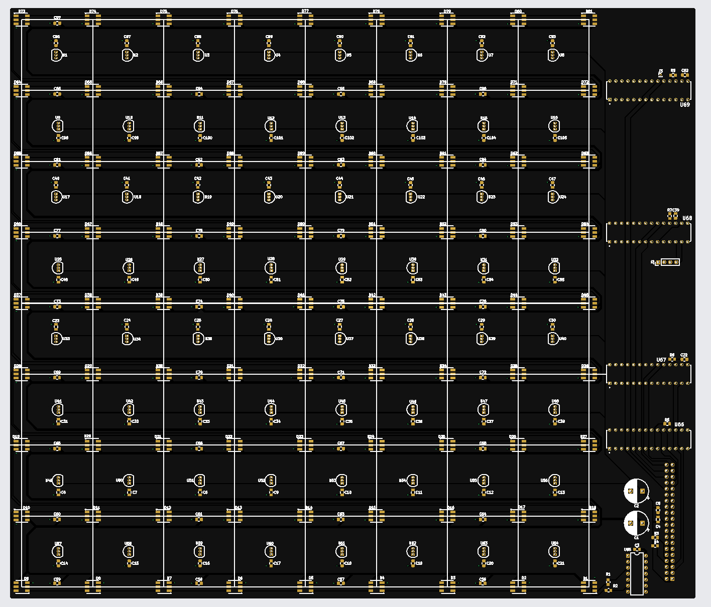
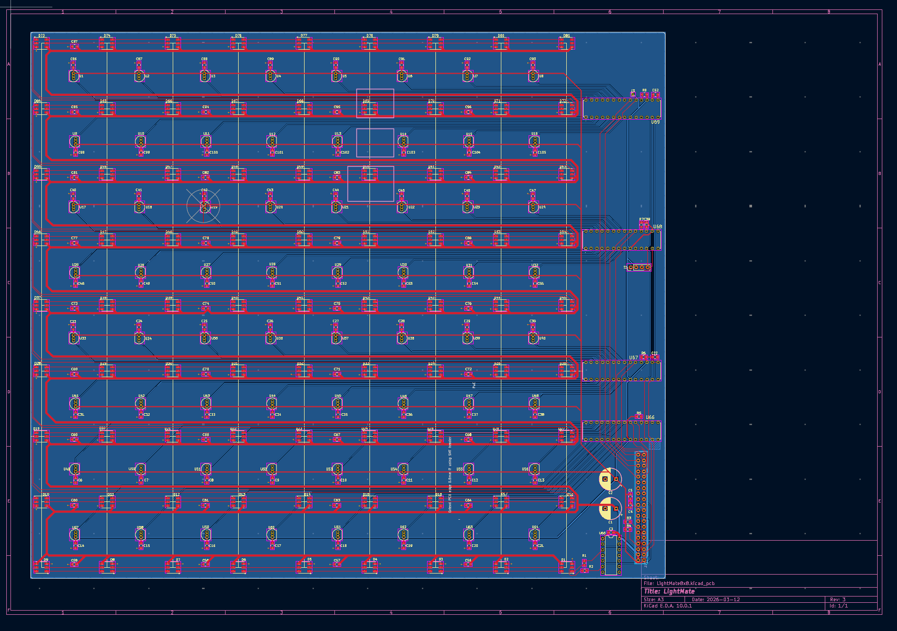

# LightMate: Smart Chessboard

LightMate is a smart, connected chessboard that combines the tactile experience of physical chess with real-time digital analysis and feedback.

## Overview

This system detects piece movement using Hall-effect sensors and provides visual feedback through addressable RGB LEDs. A Raspberry Pi processes the board state, validates moves, and enables future online gameplay integration.

## Features

- Real-time piece detection using Hall sensors  
- LED highlighting of legal moves  
- Raspberry Pi-based move validation (Python)  
- Expandable to online gameplay (Lichess API)  
- Touchscreen interface support  

---

## System Architecture

- Hall sensors connected to MCP23017 expanders (I2C)  
- Raspberry Pi processes board state  
- LEDs controlled via SPI through a level shifter  
- Touchscreen provides user interface  

---

## Hardware

- 64 × Hall-effect sensors (DRV5033)  
- 81 × SK9822 RGB LEDs  
- MCP23017 I/O expanders  
- SN74HCT125 level shifter  
- Raspberry Pi 4  
- Custom PCB  

---

## Software

The system runs a continuous loop:

1. Read sensor states  
2. Detect piece lift and placement  
3. Validate moves using `python-chess`  
4. Update LEDs for visual feedback  

---

## Demo

### Full System

### LED Move Highlighting

### Hardware (PCB + Assembly)

---

### Demo Video

A short demonstration of the system in action:

[Watch Demo Video](demo/demo_video.mp4)

---
## Challenges

- High current draw from LEDs  
- Signal integrity across long SPI LED chains  
- Magnetic interference between pieces  
- Debugging power issues on the 3.3V rail  

---

## Engineering Constraints

- Power: LED current draw up to ~2–3A  
- Size: Components must fit under each square  
- Timing: Real-time response required (<30 ms)  
- Budget: Approximately $200–250  
- Manufacturing: Dense PCB routing and soldering complexity  

---

## Future Work

- Miniaturized Compute (CM4 Integration): Replace Raspberry Pi 4 with a Compute Module integrated into a custom PCB to reduce wiring and enable a smaller, more compact enclosure.
- Stronger Chess Engine: Integrate advanced engines (e.g., Stockfish) for real-time analysis, move evaluation, and training feedback.
- Wireless & App Connectivity: Add mobile/web interface for game tracking, remote play, and cloud synchronization.
- Portable Design: Implement battery power and optimized power management for a fully portable system.
- Improved Sensor Accuracy: Enhance Hall sensor reliability and reduce magnetic interference between adjacent pieces.

---

## Documentation

- Final Report: docs/LightMate_Final_Report.pdf
- Poster: docs/LightMate_Poster.pdf  

---

## Contributors

- Omar AlOud – Hardware Schematic Design, CAD Design  
- Anas AlDarwashi – Software Design, Raspberry Pi Integration  
- James Bridges – PCB Design  

---

## Acknowledgments

Special thanks to Dr. Brickley and Dr. Martin for their guidance and support.
ELEG/CPEG498 & 499: Senior Design
University of Delaware
